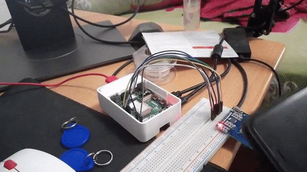

# Restaurant Covid-19 Tracker - Made for ICUE2021

How It Works

As customers enters the restaurant, they will scan their phones which have built-in RFID chips. The RFID reader then sends a GET request to our Flask webserver, saving the customer's phone number and entry time. When the customer leaves, they scan their phone a second time, which will update the webserver with their departure time. Customer data will be stored in a MongoDB database, where we can acess the information directly from out web application. 

Data Handling

The webserver will list the customer information from the database. When the owner is made aware of a potential COVID outbreak in the restaurant, they can send a POST request to update the infected customer field. Once updated, the webserver will automatically determine customers who have been in the restaurant during a specific timeframe in which an individual who tested positive was present. These potentially affected customers will be added to a seperate collection of data, and will be immediately notified via an automated Twilio text messaging service.

